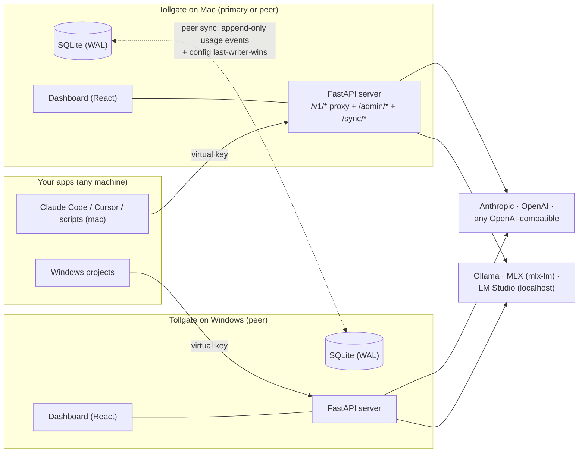

# Tollgate — Build Plan

> A local-first LLM gateway: it fronts your provider API keys (Anthropic, OpenAI, any
> OpenAI-compatible endpoint, and offline LLMs like Ollama/MLX), issues its own virtual
> keys, meters every request (tokens / cost with cache-aware pricing / latency), enforces
> limits you set (per hour / day / month), and shows it all in a Logfire-style desktop
> dashboard on macOS and Windows — with bidirectional merge sync between machines.

**Status:** all 62 tracked tasks complete (M0–M6). Owner-side steps remain before tagging v1.0: GitHub repo + tag push, Windows installer pass, real-key round-trip — see [RELEASE.md](../RELEASE.md). Track details in [02_implementation_breakdown.md](./02_implementation_breakdown.md).
**Last updated:** 2026-10-01 (rev 2: name locked, pricing engine detailed, sync promoted to core, offline providers added, per-user install confirmed)

---

## 1. Summary

You have client-provided provider keys (Claude today, more later). Tollgate becomes the
**single controlled entry point** for all LLM traffic:

- Your projects never see the real provider key. They get a **virtual key + base URL**
  generated by Tollgate; it forwards traffic upstream under the real key.
- Every request is **logged and metered** (model, tokens incl. cached tokens, estimated
  cost, latency), viewable by hour / day / month like Logfire — **per key or all keys,
  per provider or all providers, per model/project, and merged across machines or per
  machine**.
- Every virtual key has **limits**: requests, tokens, or USD spend per hour / day /
  month / total, plus expiry, disable, block, and rotate.
- Installs as a **desktop app on macOS and Windows with no admin rights** (per-user
  install only).
- Mac and Windows each run their own Tollgate against their own local SQLite;
  **bidirectional sync merges stats** so both dashboards show combined data (and
  optionally just their own).

---

## 2. Goals and non-goals

**Goals (v1)**
1. Proxy Anthropic (`/v1/messages`), OpenAI (`/v1/chat/completions`), any
   OpenAI-compatible endpoint, and **offline LLM servers** (Ollama, MLX / mlx-lm server,
   LM Studio, llama.cpp, vLLM — all speak the OpenAI wire format) with full
   **streaming (SSE) passthrough**.
2. Virtual-key lifecycle: create / disable / block / expire / rotate; scopes (allowed
   providers, models, projects).
3. Limits per key and globally: {requests, tokens, USD} × {hour, day, month, total},
   plus requests/min rate limiting. Hard-enforced at the proxy (fail closed).
4. **Cache-aware cost estimation with price history**: per-model input / output /
   cache-read / cache-write rates; when a price changes, old logs keep the old cost and
   new logs use the new cost (§6).
5. Per-request logging + aggregations: hour / day / month charts with a **global scope
   selector** (key / provider / model / project / machine), live tail, CSV/JSON export.
6. Desktop app installs on macOS and Windows **without admin rights**.
7. **Bidirectional merge sync** between Tollgate instances: both machines show merged
   stats and can filter to their own (§11).
8. LiteLLM-proxy basics, own-implementation: model aliases & routing, basic fallback,
   per-provider timeout/retry (§5).

**Non-goals (v1)**
- Multi-user / teams / SaaS — single owner (you).
- Postgres/Redis or any external server — SQLite only.
- Prompt/response content capture by default (privacy + disk; opt-in redacted previews).
- Semantic caching, evals, advanced router strategies — parking lot (§18).

---

## 3. Architecture



Each machine runs the full app (server + SQLite + dashboard in one Python process, in a
pywebview native window or browser). Machines are peers; each can also act as a thin
client of another instance (§11 Mode B). The server binds `127.0.0.1` by default; LAN /
Tailscale binding is an explicit setting used for sync and remote access.

**Why a gateway, not an SDK wrapper:** a gateway is the only shape that can (a) keep the
client key off every machine, (b) meter *all* traffic regardless of which tool makes the
call, (c) enforce limits centrally, and (d) sit in front of *offline* LLMs too — so
local-model usage is logged and limited with the same machinery.

---

## 4. Stack

| Layer | Pick | Notes |
|---|---|---|
| Language | **Python 3.12+** | Matches your shelf; best LLM-API ecosystem. |
| Server | **FastAPI + uvicorn** | Async, first-class SSE streaming, auto OpenAPI docs. |
| HTTP client | **httpx (async)** | Streaming passthrough, timeouts, retries. |
| DB | **SQLite (WAL mode) + SQLAlchemy 2 + Alembic** | Zero-ops, single file, per machine. Confirmed choice — no external DB. |
| Config | **pydantic v2 + pydantic-settings** | Typed config; price table as validated JSON. |
| Secrets | **keyring** (macOS Keychain / Windows Credential Manager), encrypted-file fallback | Provider keys never in plaintext on disk. |
| Pricing data | **vendored LiteLLM cost map** + live refresh (§6) | Data file only — no litellm dependency. |
| CLI | **typer** | `tollgate serve`, `tollgate key create …`, `tollgate sync …`. |
| Frontend | **React 18 + TypeScript + Vite + Tailwind + shadcn/ui + Recharts + TanStack Query/Table** | Built to static files, served by FastAPI; no Node at runtime. |
| Desktop shell | **pywebview** (WKWebView on mac / Edge WebView2 on Win) | Native window, no Chromium ship; browser fallback mode. |
| Packaging | **PyInstaller** → `.app`/`.dmg` (mac) and per-user installer + portable `.zip` (Win) | GitHub Actions matrix; per-user only (§13). |

**Frontend choice — React kept, deliberately.** You asked if something lighter fits.
Considered: Svelte 5 (smaller runtime, but smaller ecosystem and fewer copilot-friendly
examples), Preact (same API, saves ~40 KB — irrelevant for a local app), htmx+Jinja
(no build step, but charts/tables/SSE/live-filtering at Logfire fidelity get painful).
React wins on ecosystem, component libraries (shadcn/ui), and long-term maintainability
by a Python-first developer leaning on AI assistance. The app is local — bundle size and
runtime speed are non-issues; if that ever changes, Preact is a drop-in swap.

**Reusing LiteLLM as the core — no; borrowing its ideas — yes.** LiteLLM proxy already
does keys/budgets/routing, but it's a large, fast-moving dependency with its own stack
and opinions. We implement the basics ourselves (adapters ~300 lines per provider) and
take the proven features: virtual keys, budgets with reset periods, rate limits, model
aliases, fallback, retry/timeout config. We *do* consume LiteLLM's pricing data file
(§6) — that's where its community value is highest.

---

## 5. Core concepts

### Virtual keys
- Format: `tg-` + 40+ random urlsafe chars, shown **once** at creation.
- Stored as SHA-256 hash + display prefix (`tg-7f3a…`). Optional per-key "store
  encrypted for re-display" toggle (off by default).
- Statuses: `active`, `disabled` (manual off), `blocked` (auto, by limit breach — needs
  explicit unblock ± limit raise), `expired`.
- Rotate = issue replacement, old key gets a grace window (default 1 h) then expires.
- Metadata: name, project/tag, notes, allowed providers/models/aliases, expiry.

### Providers (upstream)
- Types: `anthropic`, `openai`, `openai-compatible`, **`local`** (Ollama, MLX/mlx-lm
  server, LM Studio, llama.cpp, vLLM presets — all OpenAI-compatible, so one adapter;
  presets just prefill base URL and quirks, e.g. `http://localhost:11434/v1`).
- Registry fields: type, name, base URL, encrypted API key (**empty allowed for local
  servers**), enabled, per-provider **timeout & retry policy**.
- Local providers: no API key upstream; usage blocks may be missing → token estimation
  fallback (`estimated=true`); default price $0 with optional custom per-1M rates for
  internal chargeback; latency stats matter most here (benchmarks!).

### Model aliases & routing (LiteLLM basics)
- Alias map: incoming model name → (provider, upstream model). E.g. a benchmark suite
  calls `model-a` everywhere; point it at Claude this week, swap to a local model next
  week without touching the suite. Also lets one key see a curated model list.
- Basic fallback: ordered fallback list per alias (first provider that doesn't 4xx/5xx
  wins; each attempt logged with which hop succeeded).
- Explicitly *not* taken from LiteLLM: teams/users, org budgets, Router strategies,
  callbacks/telemetry, DB backends.

### Limits
- **metric** ∈ {requests, tokens_in, tokens_out, tokens_total, cost_usd} ×
  **window** ∈ {minute, hour, day, month, total} × **scope** ∈ {per key, global}.
- Calendar windows (UTC internally, local display). Breach → `429` + reset info, key
  flips to `blocked` if configured. Optional warn thresholds (e.g. 80 %) → badge + webhook.

### Metering
- Prefer provider-reported usage: Anthropic `usage` (incl. `cache_read_input_tokens`,
  `cache_creation_input_tokens`), OpenAI `usage` (incl. `cached_tokens` — for streams we
  inject `stream_options.include_usage` server-side). Local servers without usage →
  chars÷4 estimate, flagged.
- Latency split per request: `upstream_ms` vs total → Tollgate reports its **own overhead
  (p50/p95)** so benchmarks through the gateway can be corrected to provider-exact
  values (§11.4).

---

## 6. Pricing & cost model (with and without cache)

### Where prices come from — ranked sources

1. **LiteLLM community cost map** (`model_prices_and_context_window.json`, repo root of
   [BerriAI/litellm](https://github.com/BerriAI/litellm/blob/main/model_prices_and_context_window.json))
   — per-token USD rates for every major model **including cache rates**
   (`input_cost_per_token`, `output_cost_per_token`, `cache_read_input_token_cost`,
   `cache_creation_input_token_cost`) plus context windows. Community-maintained via PRs
   and updated continuously. We **vendor this file** (no litellm package dependency) and
   refresh it on every app update. A live refresh is available from LiteLLM's endpoint
   (`api.litellm.ai` — same data their `cost_per_token()` uses), wired to a
   "Refresh prices now" button.
2. **OpenRouter `/api/v1/models`** — free public API returning per-model
   `pricing: {prompt, completion, cache_read, cache_write}` — optional secondary refresh
   source / cross-check.
3. **Providers themselves** — verified 2026-10-01: neither
   [Anthropic Messages](https://platform.claude.com/docs/en/api/messages/create) nor
   [OpenAI completions](https://community.openai.com/t/feature-request-include-cost-of-api-call-cents-in-api-responses/967751)
   return dollar cost in the response `usage` — token counts only. Actual billed USD
   exists only in their **Admin APIs** ([Anthropic Usage & Cost API](https://platform.claude.com/cookbook/observability-usage-cost-api),
   [OpenAI Usage/Cost APIs](https://developers.openai.com/cookbook/examples/completions_usage_api)),
   org-level and aggregated → parking lot as a monthly *reconciliation import*, not a
   per-request source.
4. **Manual editor in the UI** — for custom, aliased, and local models; your entry wins
   over any fetched map.

### Cost formula (computed per request, stored on the log row)

```
cost = tokens_in        × price_in
     + tokens_out       × price_out
     + cache_read       × price_cache_read      # e.g. Anthropic prompt-cache hits
     + cache_creation   × price_cache_write     # cache-write surcharge, when applicable
```

- UI displays per-1M-token rates and shows the breakdown (base vs cache read vs cache
  write) per request and in aggregates.
- Models with no cache pricing simply have zero cache rates in the map.
- Local models default to all-zero prices (still metered in tokens/requests/latency);
  optional custom rates for chargeback.

### Price changes over time (temporal price bands)

Requirement: when a model's price changes, **old logs keep the old cost; new logs use
the new cost**. Design:

- Prices live in a `model_prices` table as **effective-dated bands**:
  `(model, effective_from, effective_until, 4 rates, source)`. Current price =
  the band with `effective_until IS NULL`.
- A refresh that detects changed rates does **not** mutate history: it closes the open
  band at `now` and inserts a new one. The refresh dialog shows a **diff** ("Claude
  Sonnet input $3 → $3.50 per 1M") for review before applying.
- Each request computes cost from the band **effective at request time** and stores both
  the computed cost **and the band id** on the log row — cost is **frozen at log time**.
- All historical charts/aggregates sum stored costs, so history never shifts under you.
  (No recalculation feature in v1 — a read-only "what-if recalc" can come later.)

---

## 7. Data model (per machine; synced per §11)

```
providers     id, type, name, base_url, api_key_encrypted(nullable for local),
              enabled, timeout_s, retries, notes, created_at
aliases       id, alias_name, provider_id, upstream_model, fallbacks(json, ordered), enabled
model_prices  id, model, effective_from, effective_until, price_in, price_out,
              price_cache_read, price_cache_write, context_window,
              source(bundled|litellm-live|openrouter|manual)
virtual_keys  id, prefix, key_hash, [key_encrypted], name, project, status, created_at,
              expires_at, rotated_from, notes, allowed_providers, allowed_models_aliases
limits        id, key_id?|global, metric, window, value, action(reject|warn), auto_block
counters      key_id, window_start, requests, tokens_in, tokens_out, tokens_total, cost_usd
request_logs  id (ulid), instance_id, ts, key_id, provider, model, alias_used, endpoint,
              status_code, latency_total_ms, upstream_ms, tokens_in, tokens_out,
              cache_read, cache_write, cost_usd, price_band_id, is_stream, estimated,
              error, req/resp_bytes, [redacted previews], client_ip
peers         id, name, endpoint_url, token_hash, enabled, last_seen
sync_state    peer_id, last_sent_cursor, last_received_cursor, last_error
config_events id (ulid), entity, row_pk, op(upsert|tombstone), payload_json,
              origin_instance, ts                       → config sync, last-writer-wins
settings      key, value (json)
```

- `request_logs` rows are **immutable** and append-only — that is what makes merged
  stats safe. Unique on `(instance_id, id)` for idempotent merge.
- Retention: default 90 days (configurable); nightly prune; counters summarized then
  dropped. Backup = copy the DB file while stopped; optional Litestream replication later.

---

## 8. API surface

### Proxy endpoints (what your projects call — base URL is Tollgate's)
| Endpoint | Compat | Auth |
|---|---|---|
| `POST /v1/messages` (+ count_tokens) | Anthropic-native | `x-api-key: tg-…` (Bearer also accepted) |
| `POST /v1/chat/completions`, `GET /v1/models`, `POST /v1/embeddings` (later) | OpenAI | `Authorization: Bearer tg-…` |
| `GET /healthz` | — | none |

Errors use each provider's native error shape so existing SDKs surface them correctly;
we add `x-tollgate-*` headers (key id, window reset, alias resolved).

### Admin endpoints (dashboard / CLI; bearer admin token)
```
/admin/keys            CRUD + disable|enable|block|unblock|rotate|extend
/admin/limits          CRUD (key-scoped & global)
/admin/providers       CRUD + test-connection
/admin/aliases         CRUD + fallback ordering          (LiteLLM-basics)
/admin/prices          list bands, refresh (litellm-live / openrouter), diff, manual edit
/admin/logs            query + CSV/JSON export           (scope params: key/provider/model/instance)
/admin/stats           aggregates hourly/daily/monthly   (same scope params; merged or per-instance)
/admin/events/stream   SSE live tail (log rows, limit warnings)
/admin/settings        retention, binding, admin token, appearance
/admin/backup          snapshot / restore
```

### Sync endpoints (peer-to-peer; pairing token)
```
/sync/handshake        exchange instance ids, versions, capabilities
/sync/events?cursor=…  pull usage events + config events since cursor (idempotent)
/sync/push             receive peer's events (INSERT-or-ignore + LWW apply)
```

---

## 9. Request pipeline (enforcement & metering)

```
request → auth (hash lookup) → key status/expiry/allowlist checks
        → rate-limit check (counters, atomic upsert)
        → window-limit pre-check
        → resolve alias → provider (+ fallback chain on transport/5xx errors)
        → forward upstream (httpx stream; real key injected; local providers keyless)
        → stream bytes to client; tee-parse usage events
        → finalize: cost from current price band, counters + immutable log row
          (instance_id, upstream_ms, overhead), SSE push to dashboard
        → optional: limit crossed mid-stream → terminate stream cleanly + log
```

- Fail closed: upstream 5xx/timeout → logged with error, **no** usage counted, client
  gets the passthrough error (never a silent retry that double-charges limits).
- Overhead budget: target **< 5 ms added** for non-streaming calls and stream time-to-first-
  byte (local Python hop); continuously self-measured and surfaced in the UI (§11.4).

---

## 10. Dashboard (Logfire-style)

**Global scope selector on every stats page:** All keys ⇄ one key · All providers ⇄ one
provider · model · project · **All machines (merged) ⇄ this machine**. Applied client-side
to cards, charts, tables, and exports alike.

| Page | Contents |
|---|---|
| **Overview** | Range selector (today / 7 d / 30 d / custom; hour-day-month granularity). Cards: requests, tokens, est. cost (with cache breakdown), error rate, gateway overhead p50/p95. Time-series stacked by model/key/provider. Top keys/models tables. Live request tail (SSE). |
| **Keys** | Table: status chips, usage-vs-limit progress bars per window, sparklines. Create wizard: scopes → limits → expiry → show-once key. Row actions: disable/block/unblock/rotate/extend/copy report. Per-key drill-down: its hourly/daily/monthly charts + last errors. |
| **Logs** | Filterable table (time, key, provider, model, alias, status, stream, errors, machine). Detail drawer: timing (total vs upstream vs overhead), token & cost math incl. cache split, price band used, redacted previews if enabled, curl-to-reproduce. Export CSV/JSON. |
| **Providers** | Upstream config (incl. local presets), masked keys, test connection, timeout/retry policy, per-provider spend chart. |
| **Pricing** | Model price table (per 1M tokens, with/without cache), effective bands, refresh button with diff review, manual editor, price-change history. |
| **Aliases** | Alias → provider/model mapping, fallback order, per-alias traffic stats. |
| **Sync** | Peer status (last seen, cursors), pairing flow, conflict/audit log (config LWW events). |
| **Settings** | Global limits, retention, binding (localhost/LAN/Tailscale), admin token, appearance, backup/restore, check-for-updates. |

---

## 11. Multi-machine & sync

Principle unchanged: **never file-sync a live SQLite database** (WAL + two writers =
corruption). All sync is logical, over the data, not the file.

### Mode A — Standalone
One machine, everything local. Default.

### Mode B — Primary + thin client
One instance is the gateway; the other machine's projects point at it, and the other
machine's *app* (if installed) just connects to the primary's dashboard remotely.
Useful for the UTM setup with minimal moving parts; Windows VM reaches the Mac host at
the gateway IP under UTM shared networking (e.g. `http://192.168.64.1:8787`); off-LAN
via Tailscale.

### Mode C — Federated peers with bidirectional merge (the confirmed plan)
Each machine runs Tollgate with its **own local SQLite** (fast, works offline).

- **Usage/stats — append-only, conflict-free:** every log row carries
  `(instance_id, ulid)`. Sync exchanges rows since a per-peer cursor; receiving side
  does idempotent insert-or-ignore. Merge is a union — no conflicts possible.
- **Config (keys, limits, providers, aliases, settings) — last-writer-wins:** every
  change emits a `config_events` row (upsert or tombstone) with origin + timestamp;
  peers apply newest-wins; the Sync page shows an audit log of who-changed-what-when so
  LWW is never silent.
- **Views:** dashboards default to **merged (all machines)**; the scope selector filters
  to this machine / a chosen machine. Per-key and per-provider views work in both.
- **Transport v1:** direct peer-to-peer over HTTP (LAN or Tailscale — pairing via
  token), plus offline-friendly **export/import file** exchange. S3-compatible relay
  bucket later if two machines are never online together.
- **Benchmarks note:** logs carry `instance_id`, so you can always isolate runs made on
  the benchmarking machine.

### 4. Latency & benchmarks (your open question)
Routing through a local gateway adds a small, real hop: expect **~1–5 ms** on
non-streaming calls and stream time-to-first-byte (Python/FastAPI local overhead),
with **no meaningful effect on streaming throughput** after first byte. Because you
need exact benchmark numbers:

- Tollgate logs `upstream_ms` separately from total, so the dashboard shows its **own
  measured overhead (p50/p95)** — subtract/report it, or verify it's noise for your
  metric.
- Run benchmarks **on the machine hosting the gateway**. The Windows-in-UTM → Mac hop
  adds VM-NIC latency (~sub-ms but nonzero) — fine for usage, avoid it when measuring.
- Escape hatch if you ever need provider-exact TTFB: pull the real key from the
  keychain-backed secret store and hit the provider directly for that run (logs a gap,
  by design).

---

## 12. Security

- Provider keys: OS keychain via `keyring`; encrypted-file fallback keyed by a
  master key stored in the keychain (DB dir alone is useless).
- Virtual keys hashed at rest; admin token required for `/admin/*` and `/sync/*`; sync
  peers pair with tokens; recommended transport Tailscale (encrypted WireGuard).
- Bind `127.0.0.1` by default; enabling LAN/Tailscale binding requires the admin token
  and shows a clear warning.
- Logs: bodies off by default (your call, §19); opt-in previews truncated + scrubbed
  (API keys, bearer tokens, secret patterns).
- Auth failures (unknown key) rate-limited and logged.

---

## 13. Packaging, per-user install, distribution

**No admin rights needed on either OS — confirmed design:**

- **macOS:** ship a `.dmg` → drag the `.app` **to `~/Applications`** (per-user, always
  writable) or run it from any folder. No `.pkg` installers, no privileged helpers, no
  system services, no kernel/system extensions. Gatekeeper: ad-hoc signing first —
  first launch via right-click → Open (documented in README); Apple Developer ID +
  notarization is an opt-in later, not required for you. Data lives in
  `~/Library/Application Support/Tollgate` (user-owned).
- **Windows:** Inno Setup with `PrivilegesRequired=lowest` → per-user install into
  `%LOCALAPPDATA%\Programs\Tollgate` (no UAC prompt), plus a portable `.zip` that just
  runs. WebView2 is preinstalled on current Windows; installer downloads it if missing
  (user-scope).
- **Build:** `make build-web` (Vite → `app/static/`) then `make build-mac` / `build-win`
  (PyInstaller; create-dmg; Inno). GitHub Actions matrix on tags → **GitHub Releases
  only** (your call) with `.dmg`, per-user `.exe` installer, portable zips, and
  `latest.json` for the in-app update check.
- Dev fallback: `pipx install tollgate` → `tollgate serve` (also our smoke path in CI).

---

## 14. Repository layout

```
tollgate/
├─ app/
│  ├─ main.py                # FastAPI assembly, static hosting
│  ├─ config.py
│  ├─ proxy/                 # /v1/* endpoints, SSE passthrough, alias resolution, fallback
│  │  ├─ providers/          # anthropic.py, openai.py, openai_compat.py (also local presets)
│  ├─ auth/                  # virtual keys: hashing, lookup, rotation
│  ├─ limits/                # window math, counters, enforcement
│  ├─ metering/              # usage extraction, latency split
│  ├─ pricing/               # price bands, litellm map vendoring/refresh, cost calc
│  ├─ store/                 # SQLAlchemy models, alembic migrations, repositories
│  ├─ admin/                 # /admin/* REST + SSE
│  ├─ sync/                  # peer sync: events, cursors, LWW, transports (http, file)
│  ├─ security/              # keyring, encryption, redaction
│  ├─ desktop/               # pywebview shell, tray
│  └─ cli.py
├─ web/                      # React dashboard (Vite; builds into app/static)
├─ data/                     # runtime: tollgate.db, vendored price map (gitignored)
├─ tests/
├─ packaging/                # PyInstaller specs, Inno script, dmg assets
├─ .github/workflows/
├─ PLAN.md
└─ README.md
```

---

## 15. Milestones

Solo, part-time sizing; each milestone ends in a usable state.

| # | Milestone | Contents | Exit criteria | Status |
|---|---|---|---|---|
| M0 | Skeleton | Repo scaffold, FastAPI + SQLite + Alembic, Vite dashboard shell, CI (mac+win), typer CLI | `tollgate serve` shows dashboard in browser | ✅ complete |
| M1 | Core proxy | Anthropic + OpenAI + openai-compatible adapters **incl. local presets (Ollama, MLX)**, virtual keys, SSE passthrough, logging with latency split, metering, rate + daily limits | Claude Code + OpenAI SDK + local Ollama all work through Tollgate; limits verifiable via curl | ✅ complete (vs mocked upstreams; real-key pass pending) |
| M2 | Pricing + dashboard core | Vendored LiteLLM price map + refresh w/ diff, **temporal price bands**, cache-aware cost; Overview / Keys / Logs pages + **scope selector**; CSV export | Price change demo: old logs keep old cost; all stats filterable by key/provider/model | ✅ complete |
| M3 | Desktop app | pywebview shell, **per-user** PyInstaller builds (mac dmg, Win installer+zip), keyring secrets, backups, retention | Double-click app on both OSes, no admin rights anywhere | 🔶 in progress (keyring+backups done; pywebview/packaging pending) |
| M4 | Multi-machine client (Mode B) + benchmarks support | Remote binding + admin token, Windows-app→Mac-primary connection, **overhead p50/p95 stat**, UTM/Tailscale docs | UTM Windows project routes through Mac; overhead visible in dashboard | 🔶 in progress (overhead p50/p95 live; binding warning + docs pending) |
| M5 | Bidirectional sync (Mode C) | Peer pairing, event merge (idempotent), config LWW + audit, merged/per-machine views, file export/import | Mac + Windows both show merged stats; offline edits merge cleanly | ✅ complete (two-instance tests green; real two-machine pass pending hardware) |
| M6 | LiteLLM-basics + polish | Model aliases & fallback chains, per-provider timeout/retry UI, warn webhooks, redacted previews (opt-in), Playwright smoke, update check → **v1.0** | Full feature set from this plan | ✅ complete (UI smoke green; owner-side: tag push, Windows pass, real-key pass — RELEASE.md) |

---

## 16. Testing & quality

- **Unit:** window math (month edges), limit decisions, cost math incl. cache split,
  **price-band immutability (price change never alters stored log cost)**, LWW + tombstone
  logic, redaction.
- **Integration:** proxy vs mocked upstreams (`httpx.MockTransport`) — non-stream,
  stream, stream-with-usage, 4xx/5xx/timeout, fallback hop, mid-stream limit cut,
  keyless local provider, missing-usage estimation.
- **Sync:** two in-process instances exchanging events — idempotent replay, cursor
  resume, divergent config → newest wins + audit row, offline queue then reconnect.
- **SSE golden tests:** byte-fidelity of passthrough.
- **Packaging:** CI launches built app headless on both OSes, hits `/healthz` + one
  mocked round-trip.

---

## 17. Risks & mitigations

| Risk | Mitigation |
|---|---|
| SSE passthrough subtly broken | Byte-fidelity tests; real Claude streaming early in M1 |
| Price map drift/bad data (LiteLLM has had [map incidents](https://docs.litellm.ai/blog/model-cost-map-incident)) | Diff-review before applying; manual overrides always win; stored costs frozen anyway |
| Cost drift vs provider bills | Provider-reported tokens as source of truth; monthly Admin-API reconciliation import (parking lot); everything labeled "estimate" |
| Sync complexity creep | Append-only usage merge (conflict-free by construction); LWW only for config with visible audit; file transport as fallback |
| Benchmarks confounded by proxy hop | Self-measured overhead p50/p95 exposed; docs prescribe gateway-machine benchmarking |
| OpenAI/Anthropic API churn | Adapters isolated per provider; contract tests pin shapes |
| Windows SmartScreen/AV flags PyInstaller | Portable zip always published; code-sign when worth it |
| Scope creep | Non-goals + parking lot enforced; every milestone ships usable state |

---

## 18. Parking lot (explicitly later)

Monthly billed-cost reconciliation via provider Admin APIs (Anthropic Cost API, OpenAI
Cost API) · S3-compatible sync relay · semantic/exact caching · advanced router
strategies · spend-forecast charts · per-project PDF reports · prompt/response capture
with search · token-level latency waterfall · `brew`/`winget` distribution · plugin
webhook system · embeddings/rerank endpoints.

---

## 19. Decision log

| Date | Decision |
|---|---|
| 2026-10-01 | Name: **Tollgate** (`tollgate`, key prefix `tg-`). Rename root folder when scaffolding. |
| 2026-10-01 | Pricing: cache-aware (in/out/cache-read/cache-write), vendored LiteLLM cost map + refresh, **temporal price bands** — old logs keep old cost. |
| 2026-10-01 | Sync: **Mode C bidirectional merge** in scope (merged stats + per-machine views). SQLite per machine. |
| 2026-10-01 | Single user; no external DB; keep it simple. |
| 2026-10-01 | Per-user installs only — no admin rights needed on mac or Windows. |
| 2026-10-01 | Frontend: React (evaluated vs Svelte/Preact/htmx; §4). |
| 2026-10-01 | Adopt LiteLLM-proxy basics (aliases, fallback, timeout/retry) — implemented, not imported. Offline providers (Ollama/MLX) in core. |
| 2026-10-01 | Mode B acceptable for benchmarks: overhead self-measured & surfaced; benchmark on gateway machine. |
| 2026-10-01 | Request/response body logging **off by default**. |
| 2026-10-01 | Distribution: GitHub Releases only for now (dmg + per-user exe + portable zips); pipx as dev fallback. |

---

*Pricing-source references: [LiteLLM cost map](https://github.com/BerriAI/litellm/blob/main/model_prices_and_context_window.json) · [LiteLLM token usage & cost docs](https://docs.litellm.ai/docs/completion/token_usage) · [Anthropic Messages API (usage = tokens, no $)](https://platform.claude.com/docs/en/api/messages/create) · [Anthropic Admin Usage & Cost API](https://platform.claude.com/cookbook/observability-usage-cost-api) · [OpenAI Usage/Cost API cookbook](https://developers.openai.com/cookbook/examples/completions_usage_api) · [OpenAI community: no cost field in responses](https://community.openai.com/t/feature-request-include-cost-of-api-call-cents-in-api-responses/967751).*
